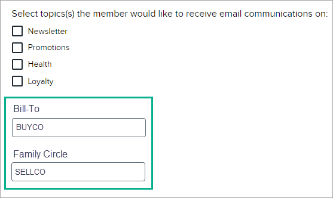

# Account Associations

:::info
This feature may not be available in your version of Console depending on configuration.
:::

Account associations allow the relationship between different accounts to be defined and managed. For example, in a corporate setting, there may be a number of branches or locations (Ship-To accounts with various addresses) that may each order supplies from a B2B vendor and have the supplies shipped to their location; but payment on these purchases is managed by a single "Bill-To" account that consolidates payment for all of those "Ship-To" locations.

The shipments go to the Ship-To locations, but the bill is paid by the Bill-To. Bill-To and Ship-To is one type of relationship that may be defined between accounts. Other types depend on the needs of the client.

If account associations are enabled in ES LoyaltyTM, then one or more additional search options are available for you to find member accounts with particular account associations. Note that account status (including Cancelled or Suspended) does not impact the ability to associate accounts, but that member accounts can only associate to an existing ES Loyalty account association.

## Search for members with specific account associations

1. From the top menu in the Console, select **Membership > Members**. Then select the account association from the list. For example, the "Bill To" and "Family Circle" options shown here are account associations:

    

2. Fill in the label value (for example, a unique name for the Bill-To location) of the associated account and click **Search**. Note that this value must be the complete and literal value. Members matching that account association are displayed in a list on the page.

## Edit a member's account associations

1. From the top menu in the Console, select **Membership > Members**. Select any option and fill in a valid value, then click **Search**.
2. In the list of members returned, click on a member record.
3. On the member landing page, under the **Accounts, Cards, Balance** tab, expand the **Member Profile** section. 
4. At the bottom of this section, account associations are displayed. If the account associations fields are blank (there are no values in them), then this member does not have account associations. 

    
    
5. To edit an existing value, replace it in the field with another valid value, then click **Update Profile**. Note that if you replace the current association value with a blank and then click **Update Profile**, the existing value will be deleted and no new association record will be created.