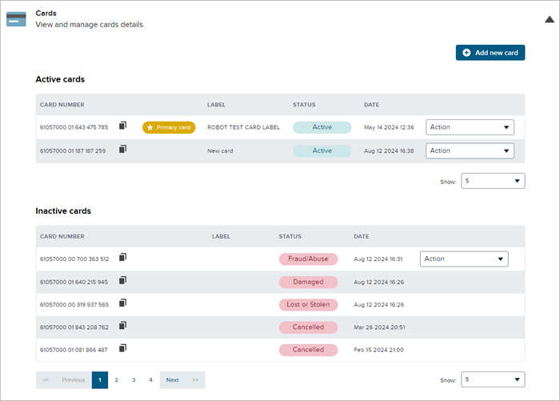

# Manage Multiple Active Cards (in Cards section)

The **Cards** section is used to facilitate the use of Multiple Active Cards. This means that there will be a **Primary** card and there may be one or more **Secondary** cards, with activities and transactions and redemptions available on all of the cards that have a status of **Active**. There is no set system limit on the number of cards in one account, but the client may have a set number of cards that an account may have.

Note that this section only appears if Multiple Active Cards are activated. If they are not, then a section named **Manage Cards** appears instead. The instructions for carrying out the following procedures differ for that other section. In addition, only the client service agent has access to this feature in the Console. The member may be able to initiate card management processes such as getting a card, but only the agent can use the Console to manage cards.

A card is considered valid if it can be used to enroll in the loyalty program. The card is considered valid for enrollment if it is allocated but not linked to a registered account, or if it is linked to an unregistered account. Conversely, the card is not valid for enrollment if it is linked to a registered account with a status such as **Active** or **Suspended**. A card is not valid for enrollment if the status is **Cancelled** or **Deceased**.

:::info
The **Cards** section will appear if configuration **is set up** to use Multiple Active Cards. If this section does appear, the **Manage Cards** section will not appear.
:::

A card may have any one of the following statuses:

- **Active** – The card is in good standing. The customer is eligible to earn and redeem points.

- **Suspended** – The card has been put into suspended status by the call or customer service center if there is suspicious or fraudulent activity occurring. The customer cannot earn or redeem. The card may be put back into **Active** status or may be progressed to **Fraud/Abuse** or **Cancelled** status, depending on the outcome of a review of card activity.

- **Lost or Stolen** – The customer has reported their card as being either lost or stolen. Customers are not able to redeem when their cards are in this status. This is a terminal state (the card cannot be set back to **Active**).

- **Damaged** – The physical card has been damaged and must be replaced. The setting renders the current card inactive and this is a terminal state (the card cannot be set back to **Active**).

- **Fraud/Abuse** – There has been an investigation resulting in a finding of fraud or abuse using this card. The setting renders the card inactive, but it can be set back to **Active** status if the investigation finds no fraud or abuse.

- **Cancelled** – The card has been cancelled, for example, upon a request from the member. This setting renders the card permanently inactive and it cannot be used again (it cannot be set back to **Active**).

:::info
    - A card cannot be added if the account status is **Closed**. If you try to add a card (**Plastic** or **Digital**) to a **Closed** account, you will see an error message.

    - Card numbers are allocated from a pool of card numbers managed by Exchange Solutions card services. If you require more information about the inventory of cards you can use, talk to your Exchange Solutions representative.
:::

## To view the Cards section:

1. From the top menu of the Console, select **Membership > Members**. Select a search method and enter the information for that method. Click **Search**, then click on the record returned to open the member details page.
2. Click in the **Cards** section to expand that section. You will see the **Active** and **Inactive** cards associated with that member and have access to options to manage the cards.

    

The **Primary** card is initially the one card associated with the account. With Multiple Active Cards enabled, the member can add cards to become **Secondary Active** cards. Once cards have been added, another card may be designated as the **Primary** card.

**Note:** Options in the **Action** menu depend on the business rules set for your configuration. The standard set of options are described below, but your configuration may vary. Contact your System Administrator for more information.

## To change the Primary card:

For a specific **Card Number** (other than the current **Primary** card), on the **Action** dropdown, select **Set as primary card**. The selected card becomes the **Primary** card and a label is shown to indicate that. The card that was previously the **Primary** card becomes a **Secondary** card. Note that either an **Active** card or an **Inactive** card can be set as the **Primary** card, but that if the card is **Inactive**, it cannot be used to redeem rewards.

## To add a new card:

1. From the top menu of the Console, select **Membership > Members**. Select a search method and enter the information for that method. Click **Search**, then click on the record returned to open the member details page.

2. Click in the **Cards** section to expand that section.

3. Click the **Add new card** button near the top of the **Cards** section.

4. In the **Add new card** window, select whether the new card will be **Plastic** or **Digital**. A **Plastic** card is a physical card that can be scanned at the point of sale. A **Digital** card can be scanned at the register from a mobile phone.

5. If **Plastic** was selected in the previous step, enter a **card number** (this is not required for a **Digital** card; the number will be automatically assigned). The beginning of the number is standard and already filled in. Fill in the remaining digits. Note that this number must be one of the legitimate numbers supplied to your organization and must correspond to an authorized printed loyalty card. Contact your System Administrator for more information.

6. Enter a **Card label** (optional). This label may provide a reminder about the function of the card or to whom it belongs.

7. Select the checkbox if you want to **Set this card as the primary card** (it will become the **Default** card in place of the current primary card). If this checkbox is not selected, the new card will be a secondary card.

8. Click **Add**.

9. If you made the new card **Primary**, a message in the window that opens warns that the new card will be the primary and the current primary will become a secondary card. If you agree, or if the new card is not the primary, click **Accept** to add the new card.

The new card is added with the parameters you have set.

## To set a secondary or inactive card as the Primary card:

1. From the top menu of the Console, select **Membership > Members**. Select a search method and enter the information for that method. Click **Search**, then click on the record returned to open the member details page.

2. Click in the **Cards** section to expand that section.

3. For a specific **Card Number**, on the **Action** dropdown, select **Set to primary card**.

4. A **Warning** window opens to confirm that the new card will be the **Default** card and the current primary will become a secondary card. If you agree, click **Accept** to make the change.

The card selected becomes the primary and the card that was previously the primary becomes the secondary.

## To update card status:

1. From the top menu of the Console, select **Membership > Members**. Select a search method and enter the information for that method. Click **Search**, then click on the record returned to open the member details page.

2. Click in the **Cards** section to expand that section.

3. For a specific **Card Number**, on the **Action** dropdown, select **Update status**.

4. In the **Update card status** window, select the status to which you are updating the card.

5. Once you have made your selection, click **Update**.

6. A **Warning** window opens to confirm the change in card status. If you agree, click **Accept** to make the change.

The card status is updated. If the card was **Active** and is now set to a different status, it is moved to the **Inactive cards** list. If the card was in the **Inactive cards** list and was changed to **Active** status, it is moved to the **Active cards** list.

## To replace a card:

1. From the top menu of the Console, select **Membership > Find Member**. Select a search method and enter the information for that method. Click **Search**, then click on the record returned to open the member details page.

2. Click in the **Cards** section to expand that section.

3. For a specific **Card Number**, on the **Action** dropdown, select **Replace**.

4. In the **Replace** window, select whether the replacement card will be **Plastic** or **Digital**. A **Plastic** card is a physical card that can be scanned at the point of sale. A **Digital** card can be scanned at the register from a mobile phone.

5. If **Plastic** was selected in the previous step, enter a **card number** (this is not required for a **Digital** card; the number will be automatically assigned). Note that this number must be one of the legitimate numbers supplied to your organization. Contact your System Administrator for more information.

6. Enter a **Card label** (optional). This label may provide a reminder about the function of the card or to whom it belongs.

7. Select the checkbox if you want to **Set this card as the primary card** (it will become the **Default** card in place of the current primary card). If this checkbox is not selected, the new card will be a secondary card.

8. Click **Replace**.

9. If you made the new card **Default**, a **Warning** window opens to confirm that the new card will be the primary and the current primary will become a secondary card. If you agree, click **Accept** to make the change.

The replacement card is added with the parameters you have set.