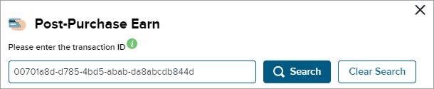
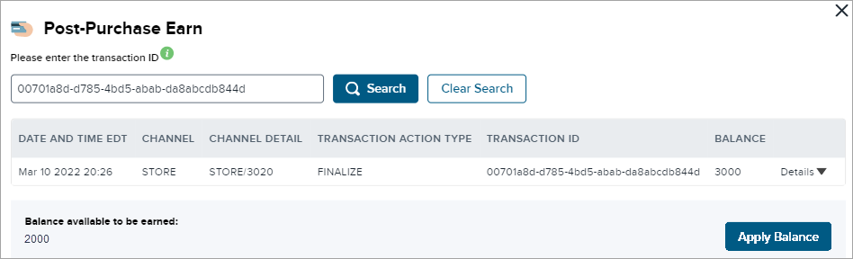

# Post Purchase Earn

Customer Service Representatives can enter a Transaction ID and apply points for members who did not receive their points (i.e., they forgot their card). This action can only be performed within 168 hours of the original transaction. Post Purchase Earn (PPE) may or may not be available depending on configuration.

:::note
This feature may not appear in the Console depending on configuration. 
:::

:::info
- When a member initiates a PPE (post purchase earn), ES Loyalty will evaluate for eligible spend and add it to their tier contribution, which could mean upgrading their tier status (as status is driven by contribution) if they are a registered member eligible for tier status.
- PPE will not result in the recalculation and issuance of points from either the ongoing tier benefit or an other offer targeted to specific tier status members. These would require evaluation of the member profile data, which the PPE process does not include.
- PPE only issues BASE points or points from MASS (audience = everyone) offers. Only the contents of the cart are evaluated.  
:::

**To attribute a Post Purchase Earn:**

1. From the top menu of the Console, select **Membership > Find Member**. Select any option and fill in a valid value, then click **Search**. Then click on the record returned to open the member details page. The Member page of the source account opens.
2. Click the **Post Purchase Earn** button at the top of the page.
3. Enter the **Transaction ID** (this can be found on the customer receipt; note that there is a 50-character limit).
4. Click **Search**.

    

    If an applicable **Transaction ID** has been entered, high-level details are displayed showing the **Balance Available** for that transaction. If you have provided an external identifier for the transaction, it is displayed here under **External Trans ID**.

    

    :::note
    If the account is not anonymous or if post purchase earn points have already been awarded on this transaction, an error message will be returned: "Account is not anonymous or a post purchase earn has already been completed."
    :::

    

5. Selecting the **Details** button will bring up a window where all the details of the transaction are displayed. If points are available to be earned, then click **Apply Points** and the points will be added to the account reward points balance. A message indicates that: "XXX points have been added to the member's account."  

    :::note
    If a PPE action is attempted on a transaction that has been voided (that is, completely reversed), an error message will be shown: "Transaction has been fully adjusted."
    :::

6. Once points have been successfully applied to the member's account, the post purchase earn transaction appears in the transaction table under the **Transactions** tab.