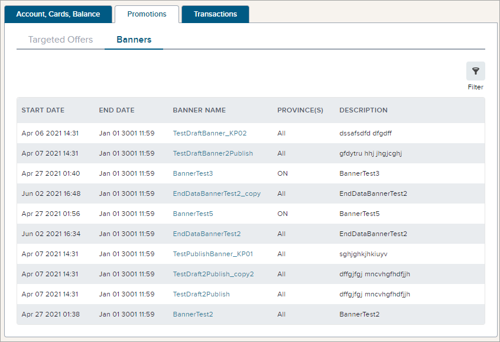

Banners are promotions presented to the member as a visual element on a web page or other interface. A banner is often designed to be the first visual element the member notices when they access the app or site. The Banners tab (under the Promotions tab) on the member management page provides access to information about each banner directed to the member, with details including:

- **Start Date** - The date/time at which the banner first becomes available to be used in an app or on a web page.
- **End Date** - The date/time at which the banner is no longer available for use.
- **Banner Name** - The name of the banner.
- **Province(s)** or **State(s)** - The province(s) or state(s) in which the banner can be used (is relevant). This may be a single province/state (two-letter code), a list of provinces/states, or All.
- **Description** - A short description of the banner.

The customer service agent can also filter on the banner date to find the banner(s) with a **Start Date** before the filter date, whether active or expired.

:::info
Depending on configuration, this feature may not be available in the Console. 
:::

### To use the filter to find a banner with a start date before the filter date:

1. Click the **Filter** button above the list of banners.
2. Click in the **Select a Date** field and either enter a specific date and time in the format shown or click the button and select a date from the calendar (the current time will be selected, but you can change it by clicking **Select Time** at the bottom of the calendar).
3. Click **Filter Results** and the banner(s) with a **Start Date** prior to the start date and time entered is/are displayed.

