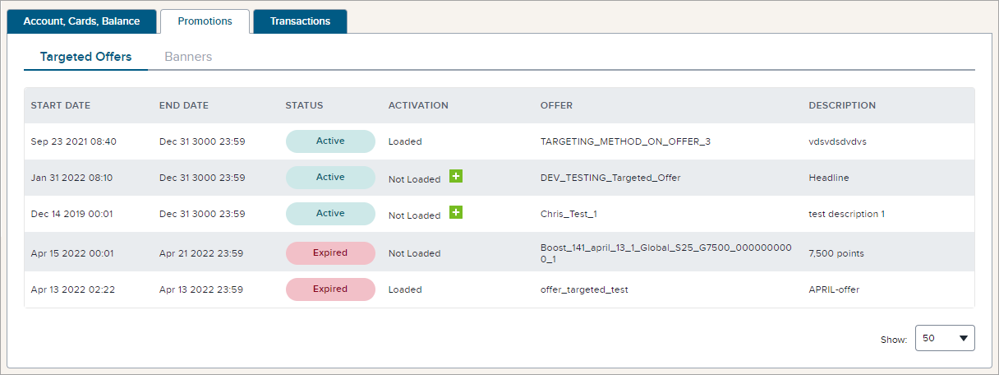

Targeted offers are promotions provided to the member based on some specific criteria about their purchases, their behaviour, demographics, postal code, etc. The Targeted Offers tab (under the Promotions tab) on the member management page provides access to information about each offer targeted to the member, with details including:

- **Start Date** - The date/time on which the offer commences.
- **End Date** - The date/time on which the offer expires.
- **Status** - The status of the offer. It may be **Redeemed** (for a redemption offer), **Expired** (if the End Date has passed), **Available** (between the Start Date and End Date, but not yet Loaded), or **Active** (accepted and ready to earn once the criteria has been met).
- **Activation** - Whether the offer has been accepted or not (**Loaded** or **Not Loaded**) or **Completed**. The agent has the ability to load the offer for a member.
- **Offer** - The name of the targeted offer.
- **Description** - A short description of the targeted offer.

The member may have an external method for loading an offer or carrying out a "load to card" operation. This is typically a Load button associated with an offer in an email sent to the member. The member does not have access to the feature to load offers in the Console; the client service agent can load an offer for a member using the Console and by clicking the green icon with the white + sign wherever it says "Not Loaded" next to an offer.

Note that whether an offer is dynamic, static, or delayed is not information provided in the offer details on this tab. If an agent or marketer wishes to see these and other details, they can navigate to **Promotions > Offers** and open an offer to view the settings, including the dynamic/static and delayed offer settings.

### To view more details about a specific targeted offer:

Click the button in the **Status** column. The section expands to show details of the targeted offer.

### To load a specific targeted offer:

1. From **Membership > Members**, search for a member by one of the methods provided.
2. Click on the name of the member to open the member page.
3. Navigate to the **Promotions** tab at the top of the page, then make sure that **Targeted Offers** is selected below. You will see the offers available to that member. The offers that are listed as **Loaded** are those the member has accepted and can be fulfilled. The offers listed as **Not Loaded** have not been accepted by the member, but they can be accepted on behalf of the member.
4. Click the **+** button next to any offer that is Not Loaded to load (accept) that offer.
    
5. In the confirmation window that opens, click **Load**. 
    
   
    The targeted offer is shown as being Loaded for that member.

