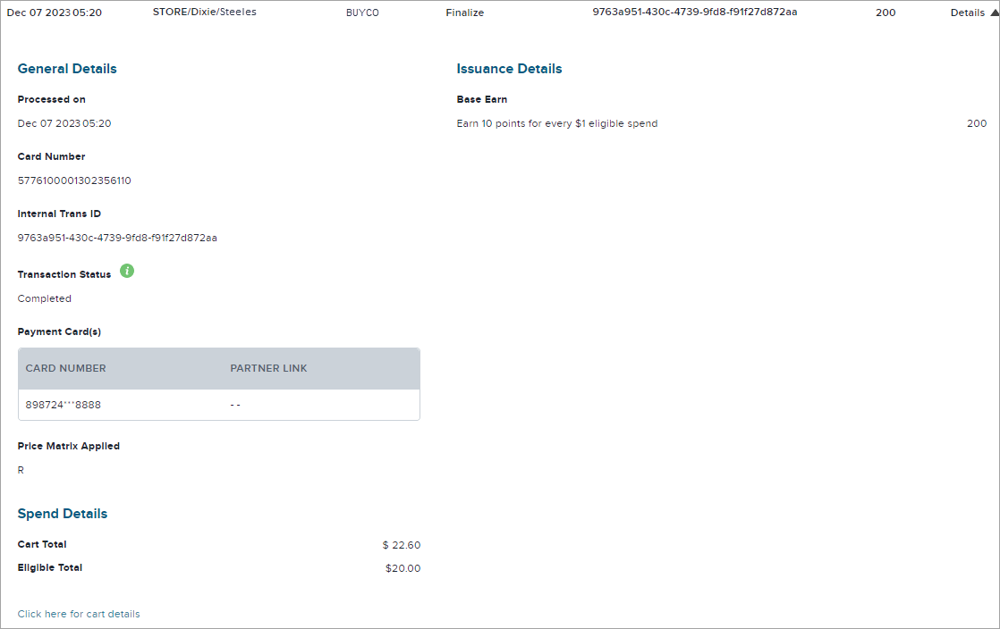
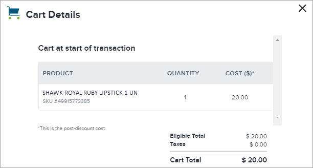

# Transactions

The **Transactions** tab provides a history of transactions associated with the member, and controls to filter the list or view details for any transaction. The view displays all loyalty transactions for the member for up to the past 24 months and provides an explanation for the balance increases and decreases. The agent can filter on the start and end dates to find specific transactions. 

There is no explicit limit on the quantity of rewards a member account may hold. However, there is usually a client-determined limit on the rewards that can be redeemed in a given period. If the number of points or rewards are higher than the maximum, then these maximum values are displayed in the **Redeemable Balance** and the **Redeemable Value** shown in the header of the member page. This limit will also be reflected in redemption transactions.

There are also limits related to the maximum number of points customer service agents can add or subtract in a single transaction through Discretionary credits, which is dependent on the agent's role and permission levels.

If an unregistered account is merged to the current user's active account, then the transactions from the unregistered card are added to those in the active account.

## List of Transactions

The main part of the tab page shows a list of transactions that involved the member. By default, a maximum of 20 transactions are shown in the list, but this can be changed using the **Show** selector in the lower corner of the tab. The details for each transaction include some or all of the following, depending on the type of transaction.

### Heading information: 

- **Date and Time** stamp - The time zone may be shown in this title as well. This is the date/time when the transaction occurred.
- **Channel Details** - The channel through which the transaction occurred (for instance, "POS/7426" indicates that the transaction occurred through a "Point of Sale" transaction at store 7426, or the transaction happened through the "SYSTEM").
- **Business Unit** - The business unit (if any) associated with the transaction.
- **Transaction Type** - For instance, an **Activity** (such as Member Registration), **Ad Hoc Redemption** (redemption provided to all specified members), **Ad Hoc Rewards** (rewards processed for all specified members), **Adjustment** (to correct a rewards balance), a **Balance Expiry** (when the account balance is expired), **Discretionary** (to award points, for instance, for goodwill), **Finalize** (completion of an in-store transaction, may include other transaction types), First-In First-Out (**FIFO**)(expiry of points), **Points Transfer** (to another member), **Post Purchase Earn** (PPE, adjustment when a card number was not available for the original transaction), **Purchase** (when a buying transaction is executed), **SAF** (after an in-store transaction if the network connection is not working, a temporarily-stored transaction, sent once the network is available), **Scheduled Redeem** (redemption on a set date), or **Tier Reward** (the rewards associated with an achieved tier) transaction.
- **Transaction ID** - A unique identifier to identify the transaction.
- **Amount** - Number of reward credits involved (which may be positive or negative).
- **Details** - Expand button opens view of the details of the transaction. This area may include (depending on the transaction type):

### General Details: 

- **Processed On** date/time stamp
- **Card Number** - unique card number associated with a loyalty card used for the transaction
- **Internal Trans(action) ID** - unique identifier for the transaction
- **Void Trans(action) ID** - used for a void transaction
- **Transaction Status** - such as Completed
- **Issuer ID** - identifier for the issuer of a payment card
- **Payment Card(s)** - cards used for payment and the associated partner links (identifiers to the partners whose payment cards are linked for transactions)
- **Employee Discount Applied** - yes or no
- **Redeemer ID** - business unit for a redemption
- A code for the **Price Matrix Applied**
- **Spend Details** - showing **Cart Total** and sometimes **Eligible Total** (both in dollars) including a link to show **Card Details** (also in dollars) and possibly a link for **Catalogue Redemption** details if the transaction involves a redemption using a catalogue item
- **Sender Info** - if points were transferred, includes the **Amount** of points and details of the sender (such as First Name, Last Name, Email, etc.)

### Issuance Details: depending on the transaction type, possible details include:

- **Base Earn** and/or **Bonus Earn**
- **Balance Expiry** - if applicable, the quantity of rewards that have been removed from the account upon expiry of the rewards
- **Expiry** - applicable if points are set to expire at the end of a period
- **Redemption** amount (and, if from a household, details of **Redemption Contribution** to show the share of the redemption from each household member)
- **Reason Code** - any messages that further describe the transaction; for example, if any or all points expected were not rewarded due to a rewards cap for that period (month, quarter, or year depending on the client's requirements), the message shown is: "Rewards limit reached"

## Filtering Transactions

**To filter the transactions in the list:**

1. Click **Filter** in the upper right-hand corner of the tab (provision of this button depends on configuration).
2. Select the type of filtering (all, two, or one of these options may be shown depending on configuration):
    -   To filter by date, enter the date range, a **Start Date** and time in the first date selector (click the calendar button) and an **End Date** and time in the second date selector. Note that both must be selected for the filter to return results. If only one is selected, then there will be an error message for the other and no results are returned.
    -   If enabled, to filter by **External Transaction Identifier**, enter the external (client) transaction ID value in the field provided. If this field is displayed, but is left empty, then all transactions will be returned (subject to the other filter settings) regardless of whether or not they have an external transaction identifier.
    -   If enabled, to filter by **Transaction Type**, select the value in the filter window. The available values are determined by configuration settings, but many include values identifying different transaction types such as: Adhoc Redeem, Finalize, SAF, and PPE.

        

3. Click **Filter Results**. If any transactions meet the criteria set, they are shown in the list.

Clear any of the filter settings by clicking **Reset Filters** in the filters window.

### Viewing Transaction Details

To view transaction details, the agent clicks on the **Details** button next to a selected transaction. The details differ depending on the **Transaction Type**.

**Notes:**

- For Finalize transactions, the **Price Matrix Applied** is included to indicate the formula used (E = Employee, R = Regular, or a customer code may apply).
- For Discretionary, Activity, Points Transfer, or Points Expiry transactions, the loyaltyId **(Card Number)** will not appear as there is no card number associated with these types of transactions.
- If the client uses a unique External ID or Order ID for the transaction that the member requires for them to interact with the client's service desk, it is also included in the transaction details for Finalize, SAF, Void, Adjustment, PPE, and in the Transaction History.
- If the member has reached their points earning cap for a given period, then a **Reason Code** appears on the transaction page with the message "Reached rewards limit." The transaction will reflect the provisions made to comply with the cap, which may include rewarding zero points if the member is already at the cap, or may result in fewer points being awarded to take the member to the cap.
- For Adhoc Redeem transactions only, an additional link may be provided on the expanded transaction details section at the bottom of the section (the link is named: **Click here for payment details**). Clicking this link opens a window which provides additional details about the transaction such as the **Batch ID**, a **Reference Code**, the **Payout Amount**, and details about the event (**Event Type**, **Event Date**, and **Event Details**). The exact information shown depends on the status of the payment: Submitted, Deferred, Cancelled, Error, or Completed.

## Examples of Finalize Transaction and Cart Details

## Exporting Transaction Histories

This feature enables users to pull a member's complete transaction history directly from the Console, whether that consists of a few transactions or hundreds.

:::info
This functionality can only be used by users with the correct permission enabled. Speak to your TSA for more information.
:::

To export all transactions for a specific user:

1. Navigate to the **Member Details** page. 
2. Click the **Transactions** tab. A list of the member's transactions is displayed.
3. Click **Generate Transaction History**. This button only appears if you have the correct permissions enabled. The Generate Transaction History File window opens.
    
    
4. In the **Generate Transaction History** File window, click **Generate File**. Generation of the file begins and the status is shown as **PROCESSING**.
    
    :::note
    Depending on the number of transactions, this process can take some time. Also, the file will not include any transactions that are currently on hold, even if they are shown in the Console.
    :::
    
5.  You can close the **Generate Transaction History** window and return later (by clicking **Generate Transaction History**) to check status. The status will change as the file is being generated, from **PENDING** to **PROCESSING** to **GENERATED**. Note that if you click **Generate File** again within the same 24-hour period, no new file will be generated; you will get the last generated file.

    

6. When the file is ready (the status is **GENERATED**), then click the **Action** menu and select **Download**. You will see a message that generation of the history has been initiated.

    :::note
    If the status changes to **FAILED** instead, then the file will not be generated. Close the window and try again. Report any issues to your TSA.
    :::
7. Provide a local download location and a file name and click **Save As**, then choose where you want to save the file and click The CSV file is saved to that location.

The file can be generated once per day. To access a generated file, click the **Generate Transaction History** button, then in the menu, select **Download**.

