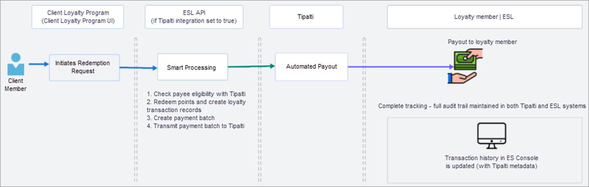

## Features Included in ES Loyalty 4.6.0

Note that these features are those introduced or completed since ES Loyalty 4.5.1.

<!-- truncate -->

### Link to Technical Release Notes

The ES Loyalty 4.6 Technical Release Notes may be viewed here: [ES Loyalty 4.6.0 - ES Loyalty - Confluence](https://esidevops.atlassian.net/wiki/spaces/WIZARD/pages/8606810113)

Fix for Multiple Accounts Sharing the Same Email Address
Note: This is a hotfix (v4.5.1 hotfix) for the v4.5.1 release but has been released simultaneously with v4.6. 

<u>Product Release description:</u>

A client encountered a pattern of two or more accounts registering using the same email address. This pattern is affecting a small percentage of the client’s loyalty program members but degrades their customer experience to the point where they may churn out of the program.

The issue was traced to how the email address locking mechanism worked in ES Loyalty, specifically differences in the letter case used for the email address. Email uniqueness for the email lock with case insensitivity was implemented and affects:

- Member Enrollment
- Member Profile Update
- Ghost card registration

Data cleansing on existing data was also required to complete the solution.

### Redemption Fulfillment API Automation Using Tipalti

<u>Product Launch description:</u>

1. Internal

- This is the integration of ES Loyalty with the global payments platform Tipalti. It facilitates the setup and operations of global direct payments of individuals or businesses from clients to their members via a variety of methods - direct deposit, ACH, PayPal, etc. (not gift card) as a method of fulfilling redemptions. Tipalti is a partner.

2. Why this is valuable

- This integration enables fast, compliant, and scalable loyalty redemptions worldwide, drastically reducing processing times while ensuring full auditability.

3. What this feature does

- It connects ES Loyalty directly with global payments platforms, automating end-to-end redemption flows and supporting multi-currency, multi-jurisdiction payouts with same-day processing.

4. How you benefit

- Your members enjoy faster, seamless redemptions that increase satisfaction, while your team gains efficiency, stronger compliance controls, and full transaction visibility in one streamlined system.

<u>Product Release description:</u>

There was a need for an automated, scalable payment solution that could handle payments in multiple jurisdictions. After investigating options, the decision was made to integrate Tipalti’s global payment platform with automated end-to-end loyalty points redemptions, enabling instant payouts across multiple currencies and jurisdictions. 

This is an improvement on existing payment options. The advantages of this one-stop solution include:

- Significant reduction in processing time - 85% reduction (from 3 to 5 days to same day processing, assuming direct deposit is done once a week) 

- Enhanced compliance and auditability

- Improved member satisfaction through faster redemptions - Same-day deposits (via direct deposit or ACH processing) compared to once-a-month cheque deposits

In terms of functionality, a client loyalty member initiates redemption through the loyalty program interface (external to Exchange Solutions). The external system transmits relevant data points to an Exchange Solutions Loyalty (ESL) API endpoint. The ESL System validates eligibility, redeems the points and create transactions records in Loyalty. It creates a payment batch and transmits the payment batch to Tipalti for payment processing. 

A CSR can view transaction and payment details in both Tipalti and in the ESL loyalty platform, ensuring a complete audit trail. A high-level end-to-end user journey diagram is shown below: 

